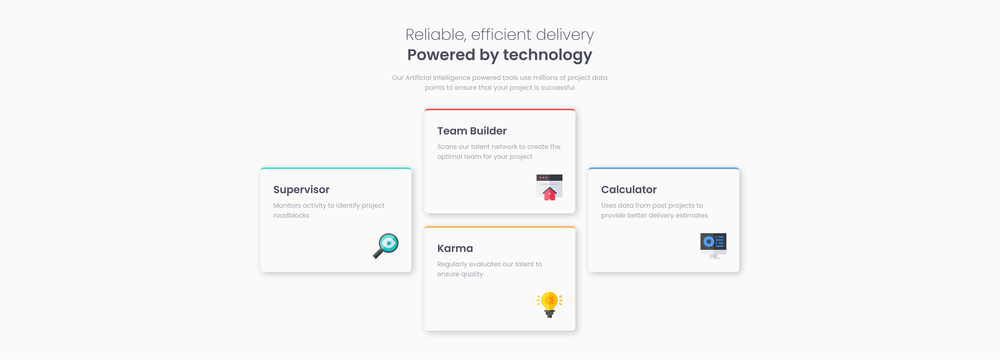

<!-- LINKS -->

## Links

- Solution URL: [Frontend Mentor Solution](https://www.frontendmentor.io/solutions/four-card-feature-section-responsive-flexbox-grid-sass-bem-tDkDouiezK)
- Live Site URL: [Live site](https://abestian.github.io/four_card_section-FM/)

<!-- ABOUT THE PROJECT -->

## About The Project

The objective of this project was to create a multi-column, responsive layout.

<!-- BUILT WITH -->

## Built With

- Semantic HTML5 markup
- CSS custom properties
- Flexbox
- Grid
- Mobile-first workflow
- SASS pre-processor
- [BEM methodology](https://getbem.com/)

<!-- ROADMAP -->

## Roadmap

- [x] Create the section view for mobile devices
- [x] Create the section view for desktop devices
- [x] Ensure responsibility and required positioning across different screen sizes

<!-- AUTHOR -->

## Author

Frontend Mentor - [@Abestian](https://www.frontendmentor.io/profile/Abestian)
